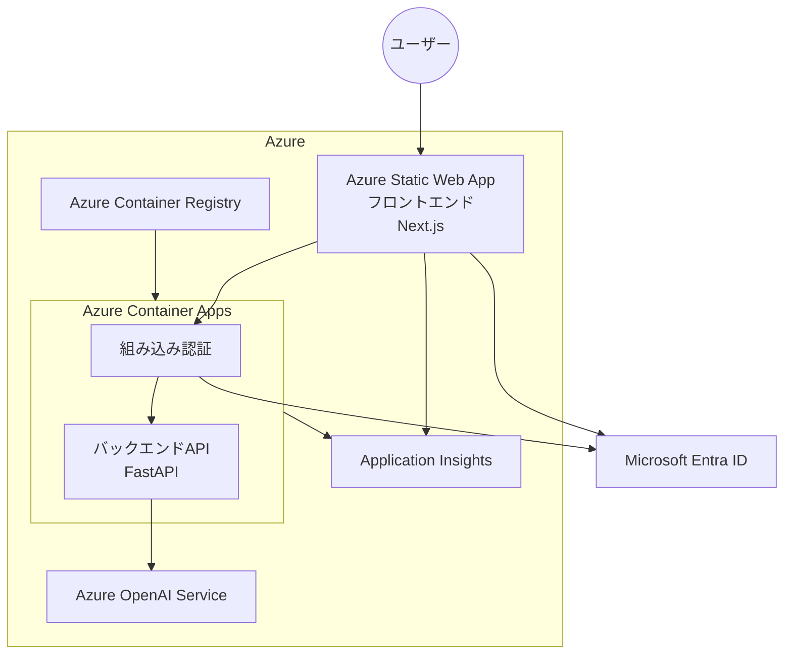

# Azure Container Apps 組み込み認証 IaCサンプル

Azure Container Apps と Entra ID認証を使用したシンプルなチャットアプリケーションです。このアプリケーションは、フロントエンドとバックエンドAPIの2つのサービスで構成されており、Azure OpenAIを使って応答を生成します。

## 背景

Azure Container AppsやAzure App Serviceには組み込みの認証機能（通称: EasyAuth）があります。ポータルからはAzureとEntra IDをまたがる設定が抽象化されており、容易に有効化できます。しかし、内部で何が行われているかが見えにくく、Infrastructure as Code（IaC）でコードへ落とし込む際に苦労しがちです。

そこで、このリポジトリはAzure Container Appsの組み込み認証をIaCで扱うサンプルを提供します。以下のような特徴があります。

- コードによる理解
  - ドキュメントだけでは理解しにくい設定を、動くコードを見て理解を助ける
- IaCツールはBicepを採用
  - Entra ID アプリケーションの操作にMicrosoft Graph用Bicepを使用（現時点ではプレビュー中のため、情報が少なく貴重）
  - [Azure Verified Modules](https://azure.github.io/Azure-Verified-Modules/)を活用
- IaCによる柔軟なカスタマイズ
  - 組み込み認証むけのアプリケーションにシークレットを使わず、マネージドIDとフェデレーションで認証（シークレット管理やローテーションが不要）
- Azure Developer CLI、VS Codeの活用
  - ツールを組み合わせ、設定の手数をできる限り少なく（BicepではできないEntra IDアプリケーションの削除をフックで実行する、など）

## 構成要素

このアプリケーションは以下のコンポーネントで構成されています：

- **フロントエンド**: Next.js（TypeScript）で実装されたSingle Page Application（SPA）。静的レンダリングし、Azure Static Web Appsでホスティング。
- **バックエンドAPI**: FastAPI（Python）で実装されたAPI。Azure Container Appsでホスティング。
- **認証**: Microsoft Entra IDを使用した認証。
- **LLM**: Azure OpenAIを使用したチャット応答の生成。
- **可観測性向上**: Application Insightsを使用したテレメトリ収集。

### 概要図



- ユーザーはフロントエンド（Azure Static Web App）にアクセス
- ユーザーはMicrosoft Entra IDを使用して認証し、フロントエンドページを取得
  - 試用中のフロントエンドページを無条件に晒したくない人向けの簡易認証
  - チャットのためのログイン機能は別にある
  - テナント問わずEntra IDユーザーであればログイン可能
- ユーザーはフロントエンドページで、チャットのために再度ログイン
  - このログインではEntra IDのテナントが限定される
- フロントエンドページはチャットメッセージをバックエンドAPIに送信
- 組み込み認証機能はEntra IDを使用してトークンを検証し、認証されたリクエストのみをバックエンドAPIに転送
- バックエンドAPI（FastAPI）はAzure OpenAIを呼び出してチャット応答を生成
- Application Insightsはフロントエンド、バックエンドAPIからテレメトリを収集
- バックエンドAPIのコンテナイメージはAzure Container Registryで管理

## 重要なコード

Azure Container Appsのパラメータ [authConfig](https://learn.microsoft.com/ja-jp/azure/templates/microsoft.app/containerapps/authconfigs?pivots=deployment-language-bicep) と、Entra IDの[アプリケーション](https://learn.microsoft.com/en-us/graph/templates/reference/applications?view=graph-bicep-1.0)、[フェデレーションID資格情報](https://learn.microsoft.com/en-us/graph/templates/reference/federatedidentitycredentials?view=graph-bicep-1.0)がポイントです。

- [Azure Container Apps - authConfigパラメータ](https://github.com/torumakabe/aca-builtin-auth-iac-sample/blob/8d05f070c06d41d4b4549d5573a344c98988e6cd/infra/resources.bicep#L358-L387)
- [Entra ID関連モジュール](./infra/modules/security/appregistration.bicep)

## テスト済み環境

- [Azure CLI](https://docs.microsoft.com/ja-jp/cli/azure/install-azure-cli): 2.77.0
- [Azure Developer CLI (azd)](https://learn.microsoft.com/ja-jp/azure/developer/azure-developer-cli/install-azd): 1.18.2
- [Docker Desktop](https://www.docker.com/products/docker-desktop/): 28.4.0
- [Node.js](https://nodejs.org/): 22.14.0
- [npm](https://docs.npmjs.com/): 11.6.0
- [uv](https://docs.astral.sh/uv/): 0.7.2
- [Ruff](https://docs.astral.sh/ruff/): 0.12.12
- [Visual Studio Code](https://code.visualstudio.com/): 1.103.2

## Azureへのデプロイ

以下は macOS / Linux / WSL での手順です。

### 必要な権限

このアプリケーションをデプロイするには、以下の権限が必要です：

- **サブスクリプションレベルの権限**：
  - 「共同作成者」ロール または
  - 以下のリソースを作成できる十分な権限：
    - Azure Container Registry
    - Azure Container Apps
    - Azure Static Web Apps
    - Azure OpenAI Service
    - Azure Application Insights
    - リソースグループ

- **Microsoft Entra IDの権限**：
  - アプリケーション登録を作成・管理できる権限

このアプリケーションはAzure OpenAIサービスを使用するため、ローカル開発を行う前にまずAzureへのデプロイが必要です。デプロイにはAzure Developer CLI (azd)を使用します。

```bash
# リポジトリをクローン
git clone https://github.com/torumakabe/aca-builtin-auth-iac-sample.git
cd aca-builtin-auth-iac-sample

# Azure CLIでログイン(azdの認証とは別に、DefaultAzureCredentialでCLIの認証情報を使う機能があるため)
az login
az account set --subscription <サブスクリプションID>

# 環境を初期化
azd init

# デプロイ
azd up
```

デプロイ後、以下のリソースが作成されます：

- Azure Container Registry
- Azure Container Apps Environment
- Azure Container App (バックエンドAPI)
- Azure Static Web App (フロントエンド)
- Azure OpenAI Service
- Azure Application Insights
- Entra ID アプリケーション登録 (APIとクライアント)

> **重要**: Azure Developer CLI (azd) には環境ごとに`.env`ファイルを管理する機能があります。当サンプルではazdが管理する`.env`ファイルがAzureへのデプロイだけでなく、ローカル実行やビルド、環境のクリーンアップ時に参照されます。ユーザーが直接`.env`ファイルを操作する必要はありません。

## Azureリソースの削除

使用後は以下のコマンドでリソースを削除できます：

```bash
# リソースを削除
azd down
```

> **重要**: `azd down`コマンドはAzureリソースを削除しますが、Microsoft Entra IDのアプリケーションを削除しません。当サンプルはazdの`predown`フックでスクリプトを呼び出し、削除します。

## ローカルでの開発

> **重要**: ローカル開発を行う前に、上記の「Azureへのデプロイ」セクションの手順に従って、Azureリソースをデプロイしてください。アプリケーションはAzure OpenAIへの接続を必要とします。

### VS Codeでのプロジェクト準備

1. プロジェクトをVS Codeで開きます

2. 前提ツールの確認/導入
   - uv をインストール（未導入の場合）
     - `curl -LsSf https://astral.sh/uv/install.sh | sh`

3. Pythonワークスペース（uv）でのセットアップ
   - ルートは uv ワークスペースとして `src/api` と `scripts` を管理します
   - 同期（プロジェクト個別）: `uv sync --project src/api` と `uv sync --project scripts`
   - 初回実行でワークスペース直下（リポジトリルート）に `.venv` が作成され、依存がインストールされます（uv ワークスペースは既定で共有仮想環境を用います）
   - Python 3.13 は uv により自動取得・利用されます

4. VS Code の Python インタープリター設定
   - コマンドパレットで `Python: Select Interpreter` を開き、リポジトリ直下の `.venv` を選択します（uv ワークスペース共有の仮想環境）
   - デバッグ実行時にプロンプトが出たら `.venv` を選択します（`.vscode/launch.json` は選択済みインタープリターを使用します）

5. 依存パッケージの更新
   - バックエンドAPI: VS Code タスク `install-api-dependencies` は `uv sync` を実行します
   - フロントエンド: `npm install` またはタスク `install-frontend-dependencies`

### ローカルでの実行

VS Codeのデバッグ機能を使って、アプリケーションを簡単に実行できます：

- **[API] Python Debugger: FastAPI (uv)** - バックエンドAPIを実行する場合（uv 管理の .venv を使用）
- **[Frontend] Debug Next.js** - フロントエンドを実行する場合

> **補足**: VS Codeのデバッグ構成(launch.json)で、Azure Developer CLIが管理する`.env`ファイルを読み込むよう設定されています。
> **補足(出力先)**: フロントエンドのデバッグ出力は VS Code の「Debug Console」に表示されます。パネルの「Debug Console」タブで実行ログを確認してください。ターミナル側でログを見たい場合は、`.vscode/launch.json` のフロントエンド構成の `console` を `integratedTerminal` または `externalTerminal` に変更できます。

### Lint / Format（Ruff）

- 設定はルート `pyproject.toml` に集約されています
- API: `cd src/api && uv sync --extra dev && uv run ruff check .`
- Scripts: `cd scripts && uv sync --extra dev && uv run ruff check .`
- フォーマット: `uv run --project src/api ruff format .` / `uv run --project scripts ruff format .`
- VS Code タスク: `lint-api`, `format-api`

### スクリプト実行（uv 管理）

- Entra ID アプリ削除スクリプト:
  - 依存同期: `uv sync --project scripts`
  - 実行（エントリポイント）: `uv run --project scripts delete-entra-app`
  - 直接実行: `uv run --project scripts python delete_app.py`

### Lock ファイルの運用

- uv はプロジェクト単位で `uv.lock` を生成・管理します（ワークスペース単一のルートロックは現行仕様ではありません）
- 本リポジトリでは以下のように管理します:
  - API: `src/api/uv.lock`
  - Scripts: `scripts/uv.lock`
- 初回はそれぞれで同期を実行してください:
  - `uv sync --project src/api`
  - `uv sync --project scripts`

### Docker ビルド/実行（API）

- マルチステージ Dockerfile を採用しています。
  - 依存固定化は builder で `uv pip compile pyproject.toml -o requirements.txt`
  - ランタイムは `python:3.13-slim` で `pip install -r requirements.txt`
  - 最終イメージには uv は含まれません／実行ユーザーは非root（UID 10001）
- ビルド: `docker build -t api:multi src/api`
- 実行: `azd env get-values > .env && docker run --env-file .env -p 8080:8080 api:multi`

## 設定

アプリケーションの設定は以下の環境変数で構成されています（これらはazdによって管理されます）：

### バックエンドAPI

- `AZURE_OPENAI_ENDPOINT`: Azure OpenAIのエンドポイント
- `AZURE_OPENAI_DEPLOYMENT_NAME`: Azure OpenAIのデプロイ名
- `AZURE_OPENAI_MODEL_NAME`: 使用するモデル名
- `AZURE_OPENAI_API_VERSION`: Azure OpenAI APIのバージョン
- `APPLICATIONINSIGHTS_CONNECTION_STRING`: Application Insightsの接続文字列

### フロントエンド

- `NEXT_PUBLIC_CHAT_API_URL`: バックエンドAPIのURL
- `NEXT_PUBLIC_ENTRA_ID_API_APP_CLIENT_ID`: Entra IDクライアントアプリのID
- `NEXT_PUBLIC_ENTRA_ID_TENANT_ID`: Entra IDテナントID
- `NEXT_PUBLIC_API_SCOPE`: APIスコープ
- `NEXT_PUBLIC_APPLICATIONINSIGHTS_CONNECTION_STRING`: Application Insightsの接続文字列

## 補足

- バックエンドAPIはAzure OpenAIやAzure Container Registryなどバックエンドサービスにプライベートエンドポイント経由でアクセスしますが、試用しやすさを考慮しパブリックアクセスも許可しています。`BACKEND_SERVICE_PUBLIC_NETWORK_ACCESS`を`Disabled`に変更すると、バックエンドサービスのパブリックアクセスを無効にできます。一方で無効にすると、インターネット経由ではバックエンドAPIのローカル実行やコンテナイメージのデプロイができなくなります。必要に応じてプライベートネットワークを構築し、当サンプルのネットワークをカスタマイズしてください。
- ログイン後、アクセス許可のためにユーザーの同意を要求します。ログアウトすると、再ログイン時に再び要求します。Entra IDでクライアントアプリケーションへ管理者同意すると要求されなくなります。

## ライセンス

このプロジェクトは [LICENSE](/LICENSE) ファイルに定義されたライセンスの下で配布されています。
